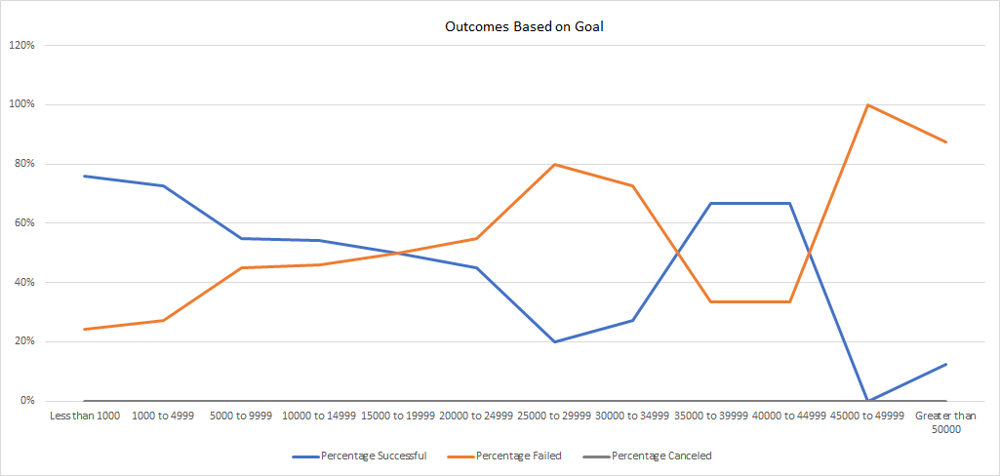

# Kickstarting with Excel

## Overview of Project
### Purpose
A promising new playwright, Louise just launched her first crowdfunding campaign to fund her play “Fever”. She used an analysis of Kickstarter data to help set her campaign up for success. Her campaign came close to its goal in a short period of time. Now, she would like to see how different campaigns fared based on their launch dates and their funding goals. The purpose of this analysis is to show Louise how other theater play campaigns fared in relation to their launch dates and funding goals. 

## Analysis and Challenges
### Analysis of Outcomes Based on Launch Date

According to the Theater Outcomes Based on Launch Date graph, successful (839) campaigns outnumbered failed (493) and cancelled (37) campaigns. An upward trend for successful campaigns is observed between March (56) and May (111), following a downward trend between May and September (59). The month of May has the highest number of successful campaigns and no campaigns were cancelled in October. 

### Analysis of Outcomes Based on Goals

According to the Outcomes Based on Goal graph, campaigns with goals less than $1000 have the highest success percentage (76). All campaigns with goals between $45000 and $49999 failed. Regardless of goal, no campaigns were cancelled.

### Challenges and Difficulties Encountered
The dataset contains many columns and can look cluttered making it hard to read. This can be resolved by hiding or deleting columns that do not pertain to the analysis.

## Results

- What are two conclusions you can draw about the Outcomes based on Launch Date?
  - May is a good month to launch theater campaigns.
  - December is not a good month to launch theater campaigns.

- What can you conclude about the Outcomes based on Goals?
  - Campaigns with lower goals were more successful.
  
- What are some limitations of this dataset?
  - This dataset only includes data up until 2017; it could have findings more relevant to current times if it included more recent data. It is also not representative of all campaigns launched as the dataset does not include campaigns from other crowdfunding platforms outside of Kickstarter.

- What are some other possible tables and/or graphs that we could create?
  - We could create a table that includes the duration of the campaigns. From this, we can find out what the average duration was for successful campaigns versus failed campaigns and determine if the duration of campaigns could be a factor of whether a campaign is successful. Instead of a line graph, I would use a Stacked Column chart to present the Outcomes Based on Goals to better visualize the percentage of successful and failed campaigns as we are not looking at trends involving dates.
